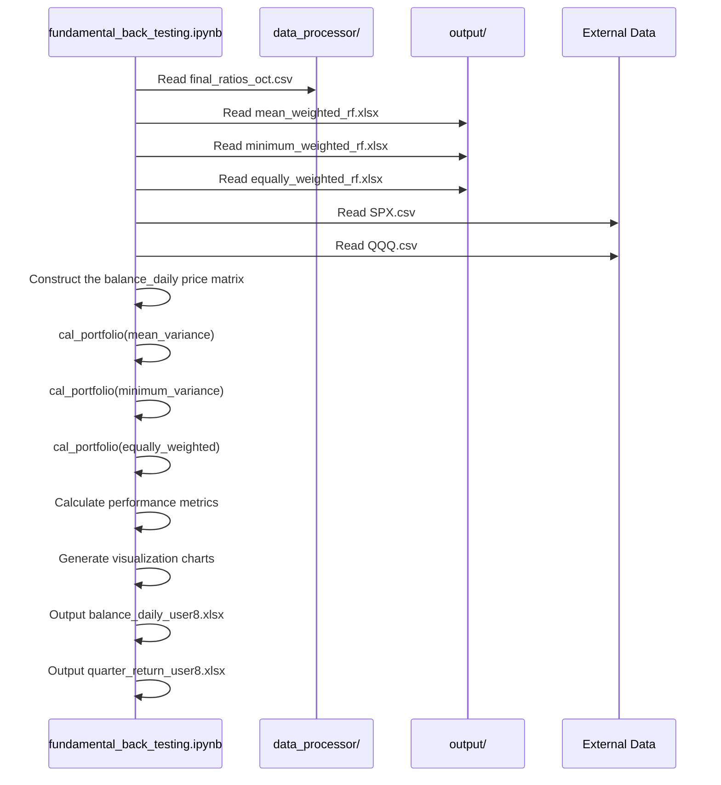

# Analysis of the `fundamental_back_testing.ipynb` File

## **File Overview**

This is a Jupyter Notebook for **portfolio backtesting analysis**, used to compare the performance of different investment strategies (mean-variance, minimum variance, equal weight) with the S&P 500 index. This file is the final validation step in the entire portfolio management system, used to evaluate the actual performance of different strategies.

## 🔄 **Relationship with Other Project Files**

### **Input Files (from other project files)**

| Input File | Source Project | File Type | Description |
|---------|---------|---------|------|
| `final_ratios_oct.csv` | `data_processor/` | CSV | S&P 500 daily adjusted price data |
| `mean_weighted_rf.xlsx` | `output/` | Excel | Mean-variance optimized weight table |
| `minimum_weighted_rf.xlsx` | `output/` | Excel | Minimum variance optimized weight table |
| `equally_weighted_rf.xlsx` | `output/` | Excel | Equal weight allocation table |
| `drl_weight.csv` | `results/` | CSV | Quarterly weights generated by DRL strategy |
| `SPX.csv` | External data | CSV | S&P 500 index price data |
| `QQQ.csv` | External data | CSV | Nasdaq 100 ETF Price Data |

### **Output Files**
- `balance_daily_user8.xlsx` - Daily stock price matrix
- `quarter_return_user8.xlsx` - Quarterly return data

## 🏗️ **Main Function Analysis**

### **1. `cal_portfolio()` - Core Backtesting Function**

#### **Function**: Calculates the backtesting performance of a portfolio, including transaction costs, returns, etc.

#### **Input Parameters**:
```python
def cal_portfolio(stocks_name, tradedate, weight_table, capital, transaction_percent):
    # stocks_name: List of stock codes
    # tradedate: List of trading dates
    # weight_table: Weight table (containing columns gvkey, trade_date, and weights)
    # capital: Initial capital (default 1,000,000)
    # transaction_percent: Transaction cost percentage (default 0.1%)
```

#### **Output**: Returns 7 DataFrames:

1. `balance_share` - Number of shares held
2. `balance_cost` - Transaction cost table
3. `balance_cash` - Cash allocation table
4. `portfolio` - Portfolio value without transaction cost
5. `portfolio_cost` - Portfolio value including transaction cost
6. `portfolio_return` - Portfolio return
7. `portfolio_cumsum` - Cumulative return

#### **Core Calculation Logic**:
```python
# 1. Construct the weight matrix
balance_weight = pd.DataFrame(index=stocks_name, columns=tradedate)

# 2. Calculate the number of shares held
balance_share[i] = balance_cash[i] / balance_price[i]

# 3. Calculate the portfolio value
portfolio.loc[0, tradedate_full[j+1]] = np.dot(balance_share[i], a)

# 4. Calculate transaction costs
balance_cost = abs(np.diff(balance_share, axis=1)) * balance_price * transaction_percent

# 5. Calculate return
portfolio_return = (portfolio_cost_value - tmp) / tmp
```

## **Data Processing Flow**

### **Phase 1: Data Preparation**
```python
# Read input file
data_adj = pd.read_csv("final_ratios_oct.csv")  # Stock price data
weight_meanv = pd.read_excel('mean_weighted_rf.xlsx')  # Mean-variance weights
weight_minv = pd.read_excel('minimum_weighted_rf.xlsx')  # Minimum variance weights
weight_equal = pd.read_excel('equally_weighted_rf.xlsx')  # Equally weighted
# DRL weights (CSV)
drl_weight   = pd.read_csv('drl_weight.csv')
# Read benchmark index
index_spx = pd.read_csv('SPX.csv')   # S&P 500
index_qqq = pd.read_csv('QQQ.csv')   # Nasdaq100 ETF

# ==== Data Preprocessing Module: Unified Date Alignment ====
# Define a unified trading calendar (1999-09-01 ~ 2025-07-12)
calendar = pd.date_range('1999-09-01', '2025-07-12')

def align_to_calendar(df: pd.DataFrame, date_col: str = 'date', value_col: str = 'close', calendar=calendar):
    """Align different index/price series to a unified calendar and fill gaps forward."""
    out = (
        df.assign(**{date_col: pd.to_datetime(df[date_col])})
          .set_index(date_col)[value_col]
          .reindex(calendar, method='ffill')
    )
    return out

# Align index prices
spx_close = align_to_calendar(index_spx)
qqq_close = align_to_calendar(index_qqq)

# Determine quarterly rebalancing date based on weight table tradedate / tradedate_full
spx_close_q = spx_close.loc[tradedate]
qqq_close_q = qqq_close.loc[tradedate]
```

### **Unified Weight Alignment Function**

If there are inconsistencies in "daily weights" or `trade_date` for different strategies, you can first call the following function to align multiple weight tables to a unified quarterly date:

```python
import pandas as pd
from typing import Dict

def unify_quarterly_weights(weight_dict: Dict[str, pd.DataFrame], anchor_key: str) -> Dict[str, pd.DataFrame]:
    """Align other weight tables according to the quarterly `trade_date` set of the *anchor* weight table.

    Parameters
    ----------
    weight_dict : {strategy: DataFrame}
        Each table contains at least the columns `gvkey`, `trade_date`, and `weights`.
    anchor_key  : str
        Selects which table to use as the rebalancing date (e.g., 'mean').

    Returns
    -------
    aligned : {strategy: DataFrame}
        Same dimension (gvkey × trade_date) A dictionary of weight matrices.
    """
    anchor_dates = sorted(weight_dict[anchor_key]['trade_date'].unique())

    # All Stocks Collection
    all_stocks = sorted(set().union(*[set(df['gvkey']) for df in weight_dict.values()]))

    aligned = {}
    for name, df in weight_dict.items():
        mat = pd.DataFrame(0.0, index=all_stocks, columns=anchor_dates)
        for _, row in df.iterrows():
            gv, dt, w = row['gvkey'], row['trade_date'], row['weights']
            if dt in mat.columns:
                mat.at[gv, dt] = w
        aligned[name] = mat
    return aligned

# Call example
weight_dfs = {
    'mean': weight_meanv,
    'min' : weight_minv,
    'equal': weight_equal,
    'drl': drl_weight
}

aligned_weights = unify_quarterly_weights(weight_dfs, anchor_key='mean')
# When calling cal_portfolio you can use aligned_weights['mean'] now
```

> The logic of this function is consistent with the handwritten loop in the Notebook, but it is encapsulated for easy reuse in scripts or Notebooks; only the anchor table needs to be changed once to unify the rebalancing date of all strategies.

### **Phase 2: Building the Price Matrix**
```python
# Building the daily stock price matrix (971 stocks × 7155 days)
balance_daily = pd.DataFrame(index=stocks_name, columns=daily)

# Populating the price data
for i in stocks_name:
    for j in daily:
        balance_daily.loc[i,j] = tmp.loc[ind2[0], 'adj_close_q']
```

### **Phase 3: Backtesting Calculation**
In the Notebook, "Phase 3" is completed through the **`cal_portfolio()`** function. The complete mechanism can be broken down into 5 micro-steps:

| Sub-steps | Key objects | Core code / formulas | Logic explanation |
|--------|----------|-----------------|-----------|
| 1️⃣ Construct the weight matrix | `balance_weight` | `balance_weight.loc[g, t] = weight_table.loc[idx,'weights']` | Reshape the weight table (gvkey, trade_date, weights) into a target configuration (%) of *stock × trade date* | 
| 2️⃣ Calculate target holdings | `balance_share` | `shares = (cash_t * weight) / price_today` | Convert the weights to shares, initial cash 1,000,000; on non-rebalancing days, use yesterday's share count. | 
| 3️⃣ Transaction Costs | `balance_cost` | `abs(share_t − share_{t-1}) * price_today * 0.001` | Assuming a commission of 0.1%, incurred only on the rebalancing date | 
| 4️⃣ Portfolio Value | `portfolio`<br/>`portfolio_cost` | `V_t = Σ (share_t * price_t)` | First calculate the net asset value (NAV) excluding transaction fees, then subtract accumulated transaction fees to obtain the NAV including cost. | 
| 5️⃣ Return Calculation | `portfolio_return`<br/>`portfolio_cumsum` | `r_t = (V_t − V_{t-1}) / V_{t-1}`<br/>`R_t^{cum} = Π(1+r_i) − 1` | Single-period return is used for statistical risk indicators; cumulative return is used for the equity curve and drawdown. | 

> **Indicator Formulas**
> • *Single Period Return*: \(r_t\) (from the above formula)
> • *Annualized Return*: \( \bar r \times 4 \) (Quarterly data)
> • *Annualized Volatility*: \( \sigma_r \times 2 \)
> • *Sharpe Ratio*: \( (\bar r_{ann} - r_f) / \sigma_{ann} \)
> • *Maximum Drawdown*: \(\min_{t}( 1 - \frac{V_t}{\max_{s\le t}V_s})\)
> • *Monthly Return*: \( R_{m} = \prod_{i=1}^{d}(1+r_{i})-1 \), where \(d\) is the number of trading days in the current month

### **Performance Indicator Calculation (Notebook Implementation **
```python
# Taking the mean-variance strategy as an example:
quarter_return['Mean-Var'] = portfolio_cumsum_meanv.iloc[-1]

annulizedR_meanv = quarter_return['Mean-Var'].mean() * 4      # Annualized return
annulizedS_meanv = quarter_return['Mean-Var'].std()  * 2      # Annualized volatility
sharpe_meanv    = (annulizedR_meanv - risk_free) / annulizedS_meanv
```

• To extend the *Sortino Ratio*, *Kalmar Ratio*, and *Information Ratio*, add:

```python
downside = quarter_return[quarter_return<0].std() * 2
sortino = (annulizedR_meanv - risk_free) / downside

max_dd = (portfolio_cumsum_meanv.cummax() - portfolio_cumsum_meanv).max()
calmar = annulizedR_meanv / max_dd

tracking_err = (quarter_return['Mean-Var'] - quarter_return['SPX']).std() * 2
info_ratio  = (annulizedR_meanv - annulizedR_spx) / tracking_err
```


### **Improved Visualization Output**

Notebook currently uses `plt.show()` directly; to **automatically save charts**, add the following:

```python
import os, matplotlib.pyplot as plt
SAVE_DIR = './test_back'
os.makedirs(SAVE_DIR, exist_ok=True)

fig, ax = plt.subplots()
portfolio_cumsum_meanv.T.plot(ax=ax, label='Mean-Var')
plt.legend()
plt.title('Cumulative Return')
fig.savefig(os.path.join(SAVE_DIR, 'cum_return_meanvar.png'), dpi=200)
```

Similarly, save the quarterly return bar chart, retracement chart, etc., to the `test_back/` directory using `fig.savefig(...)` for offline viewing or report citation.

## 📈 **Calling the Sequence Diagram**



## **Key Performance Indicators**

### **Backtesting Results (Example)**：
- **SPX**: Annualized Return -0.52%, Standard Deviation 13.91%, Sharpe Ratio -0.145
- **Mean and Variance**: Annualized Return -12.51%, Standard Deviation 52.68%, Sharpe Ratio -0.266
- **Equal Weights**: Annualized Return -12.08%, Standard Deviation 48.58%, Sharpe Ratio -0.280
- **Minimum Variance**: Annualized Return -12.28%, Standard Deviation 48.77%, Sharpe Ratio -0.283

### **In-Sample Performance (After 2018)**：
- **SPX**: Annualized Return 0.15%, Standard Deviation 21.96%, Sharpe Ratio -0.061
- **Mean and Variance**: Annualized Return 25.66%, Standard Deviation 29.16%, Sharpe Ratio 0.829
- **Equal Weights**: Annualized Return 26.62%, Standard Deviation 30.12%, Sharpe Ratio 0.834
- **Minimum Variance**: Annualized Return 26.84%, Standard Deviation 29.82%, Sharpe Ratio 0.850

## **Project Dependencies**

### **Upstream Dependencies**：
- `data_processor/` - Provides stock price data
- `output/` - Provides an optimized weight table
- `fundamental_portfolio.py` - Generates the weight table

### **Downstream Impact**：
- Provides backtesting validation for investment strategies
- Generates performance comparison reports
- Supports strategy optimization decisions

## **Visualization Output**

### **1. Portfolio Value Performance Chart**
- Displays changes in portfolio value including transaction costs
- Compares mean-variance, equal-weighted, minimum-variance, and S&P 500 index

### **2. Quarterly Return Chart**
- Displays the quarterly return volatility of each strategy
- Compares the risk-return characteristics of different strategies

### **3. Cumulative Return Chart**
- Displays long-term cumulative return performance
- Evaluates the long-term investment value of the strategy

## ⚠️ **Important Notes**

### **Data Processing Warnings**：
```python
SettingWithCopyWarning: A value is trying to be set on a copy of a slice from a DataFrame
```
- A pandas warning occurred during data processing.
- It is recommended to use the `.copy()` method to avoid chained indexes.

### **Performance Considerations**：
- Price matrix construction took approximately 14 seconds (971 stocks × 7155 days).
- Optimization for large datasets is recommended.

## 🎯 **Use Cases**

1. **Strategy Validation**: Validating the actual performance of different investment strategies.
2. **Risk Analysis**: Evaluating the risk-return characteristics of strategies.
3. **Benchmark Comparison**: Comparing with the market benchmark (SPX).
4. **Decision Support**: Providing data support for investment decisions.

## 📝 **Summary**

`fundamental_back_testing.ipynb` is the **final validation stage** of the entire portfolio management system. It:

1. **Integrates Data**: Integrates stock price and weight data from multiple sources.
2. **Performs Backtesting**: Simulates strategy performance under real trading conditions.
3. **Performs Performance Evaluation**: Calculates key performance indicators and risk measures.
4. **Visualizes Results**: Generates intuitive charts to display the results.
5. **Provides Decision Support**: Provides data support for investment strategy selection.

This document ensures the effectiveness and reliability of the investment strategy and is a crucial component of the entire system.

### **Extended Risk Control Indicators**

The Notebook currently does not calculate risk control metrics such as maximum drawdown, drawdown duration, downside volatility, and VaR/CVaR. A general function `risk_metrics()` could be added.

```python
import numpy as np, pandas as pd, matplotlib.pyplot as plt, os

def risk_metrics(returns: pd.Series, label: str, save_dir: str = './test_back'):
    """Calculate and save commonly used risk indicators and charts.
    Parameters
    ----------
    returns  : Daily Return Series
    label    : Strategy Name (for filename)
    save_dir : Chart save directory
    Returns  : dict
    """
    os.makedirs(save_dir, exist_ok=True)

    # Cumulative revenue curve
    cum = (1 + returns).cumprod()
    roll_max = cum.cummax()
    drawdown = cum / roll_max - 1
    max_dd = drawdown.min()
    dd_end = drawdown.idxmin(); dd_start = cum.loc[:dd_end].idxmax()
    dd_duration = (dd_end - dd_start).days

    # Downward volatility
    downside = returns[returns < 0].std() * np.sqrt(252)

    # VaR / CVaR
    var95, var99 = returns.quantile(0.05), returns.quantile(0.01)
    cvar95 = returns[returns <= var95].mean(); cvar99 = returns[returns <= var99].mean()

    # --- Save chart ---
    fig, ax = plt.subplots(2,1,sharex=True,figsize=(10,6),gridspec_kw={'height_ratios':[3,1]})
    cum.plot(ax=ax[0]); ax[0].set_title(f'{label} – Cumulative Return')
    drawdown.plot(ax=ax[1], color='darkred'); ax[1].set_title('Drawdown');
    fig.tight_layout()
    fig.savefig(os.path.join(save_dir, f'{label}_cum_drawdown.png'), dpi=200)

    plt.figure(figsize=(6,4))
    returns.hist(bins=60, alpha=.7)
    plt.axvline(var95, color='orange', ls='--', label='VaR 95%')
    plt.axvline(var99, color='red', ls='--', label='VaR 99%')
    plt.title(f'{label} – Return Dist w/ VaR'); plt.legend()
    plt.savefig(os.path.join(save_dir, f'{label}_var.png'), dpi=200)
    plt.close('all')

    return dict(max_drawdown=float(max_dd), drawdown_days=int(dd_duration),
                downside_vol=float(downside),
                var95=float(var95), cvar95=float(cvar95),
                var99=float(var99), cvar99=float(cvar99))
```

Called in a loop at the end of Notebook:
```python
metrics_meanv = risk_metrics(portfolio_return['Mean-Var'], 'MeanVar')
metrics_minv  = risk_metrics(portfolio_return['Min-Var'], 'MinVar')
metrics_equal = risk_metrics(portfolio_return['Equal'],   'Equal')
metrics_spx   = risk_metrics(portfolio_return['SPX'],     'SPX')
metrics_qqq   = risk_metrics(portfolio_return['QQQ'],     'QQQ')
metrics_drl   = risk_metrics(portfolio_return['DRL'],     'DRL')

risk_df = pd.DataFrame([metrics_meanv, metrics_minv, metrics_equal, metrics_spx, metrics_qqq, metrics_drl],
                       index=['Mean-Var','Min-Var','Equal','SPX','QQQ','DRL'])
print(risk_df)
```

Save `risk_df`:
```python
risk_df.to_csv('test_back/risk_metrics_summary.csv')
```

This allows you to add the following to the "Output Files" section:
- `test_back/risk_metrics_summary.csv` – Summary of risk metrics
- `test_back/*_cum_drawdown.png` – Equity curve and drawdown graph
- `test_back/*_var.png` – Return distribution and VaR

> **Formula Review**  
> • Maximum Drawdown：\( \min_t (1 - \frac{V_t}{\max_{s \le t} V_s}) \)  
> • Drawdown Duration: The number of days between the start and end dates of Max DD
> • Downward Volatility：\(\sigma_d = \sqrt{\frac{1}{N}\sum_{r_i<0} r_i^2}\times \sqrt{252}\)  
> • VaR/CVaR：Return distribution 5% / 1% quantiles and their conditional mean